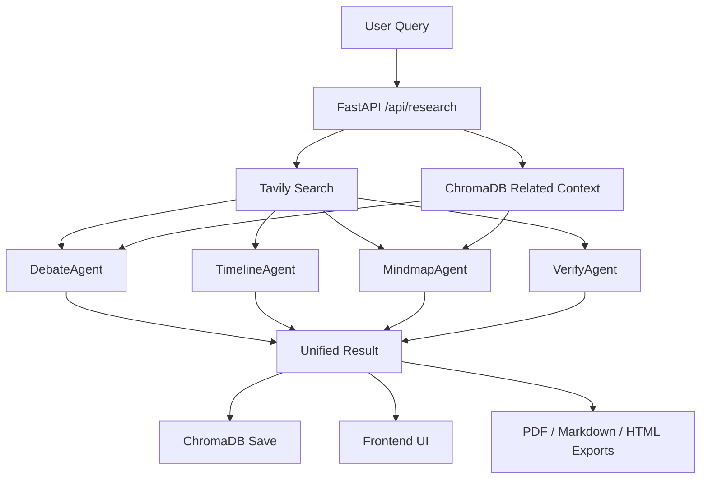
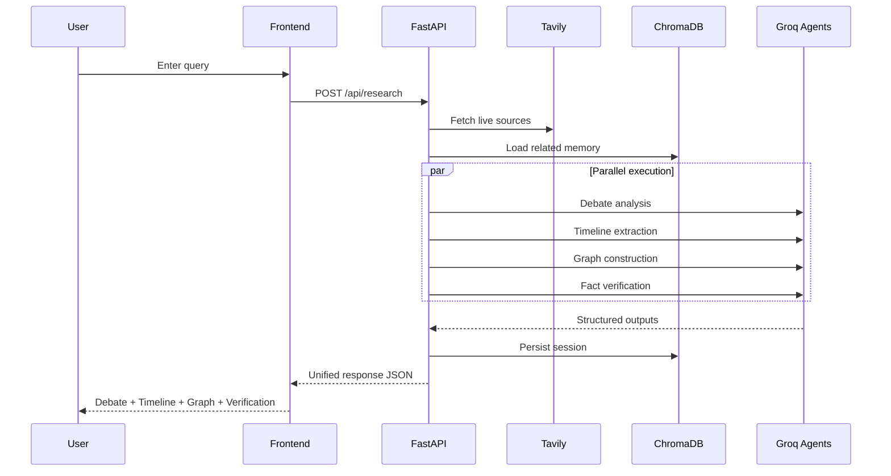

<div align="center">

# 🔬 Nexus Research
## *Parallel Multi-Agent AI Research System*

**One query. Four AI agents running in parallel. Real-time web search, etstructured debate analysis, historical timelines, interactive knowledge graphs, and fact verification — all delivered via live WebSocket streaming.**

<br/>

[](https://github.com/Yashaswini-V21)
[](https://github.com/Yashaswini-V21/Nexus-Research)
[](https://youtu.be/26-yIEpC15g)

[](https://python.org)
[](https://fastapi.tiangolo.com/)
[](https://groq.com)
[](https://tavily.com)
[](https://trychroma.com)
[](https://docker.com)
[](https://visjs.org)
[](https://www.reportlab.com)
[](LICENSE)

<br/>

### 🔗 Quick Access

[Overview](#-overview) • [Quick Start](#-quick-start) • [Demo Video](#-demo-video) • [Environment Variables](#-environment-variables) • [Troubleshooting](#-troubleshooting) • [API](#-api-reference) • [Roadmap](#-roadmap)

**Why This Matters:** Multi-agent orchestration, semantic memory persistence, real-time streaming, and end-to-end product thinking — all in one portfolio project.

</div>


## 🚀 Overview

**Nexus Research** is a multi-agent AI research platform that analyzes any topic through four distinct analytical lenses simultaneously. Instead of a single LLM response, you get a comprehensive, multi-dimensional research report — complete with interactive visualizations, source-grounded facts, and exportable reports in PDF, Markdown, and HTML formats.

### What Makes It Different

| Traditional Research Tools | Nexus Research |
|:---|:---|
| Single LLM response | **4 parallel AI agents**, each with a distinct analytical lens |
| No source grounding | **Real-time Tavily web search** feeds every agent with live data |
| Stateless conversations | **ChromaDB vector memory** persists & semantically retrieves past sessions |
| Text-only output | **Interactive knowledge graph** (vis-network) + PDF / Markdown / HTML export |
| Sequential processing | **Async parallel execution** — all 4 agents run simultaneously via `asyncio.gather` |
| No progress feedback | **WebSocket streaming** — real-time stage updates as each agent completes |


## 🧠 The Four Research Dimensions

Every query is analyzed through **four specialized AI agents** running in parallel:

```
                         ┌──────────────────┐
                         │    USER QUERY    │
                         └────────┬─────────┘
                                  │
                     ┌────────────┴────────────┐
                     │   Tavily Web Search      │
                     │   5 results · basic/deep │
                     └────────────┬────────────┘
                                  │
              ┌───────────┬───────┴───────┬───────────┐
              ▼           ▼               ▼           ▼
        ┌──────────┐ ┌──────────┐ ┌────────────┐ ┌──────────┐
        │  DEBATE  │ │ TIMELINE │ │ KNOWLEDGE  │ │   FACT   │
        │  AGENT   │ │  AGENT   │ │   GRAPH    │ │ VERIFIER │
        └────┬─────┘ └────┬─────┘ └─────┬──────┘ └────┬─────┘
             │            │              │             │
             └────────────┴──────┬───────┴─────────────┘
                                 ▼
                    ┌────────────────────────┐
                    │   Unified JSON Report  │
                    │   ChromaDB · PDF Export │
                    └────────────────────────┘
```

| | Dimension | Agent | Output |
|:-:|:----------|:------|:-------|
| ⚖️ | **Debate Analysis** | `DebateAgent` | Mainstream view, devil's advocate contrarian view, synthesis & verdict |
| 📅 | **Historical Timeline** | `TimelineAgent` | 8–12 chronological events with type badges, era summary, future outlook |
| 🕸️ | **Knowledge Graph** | `MindmapAgent` | 10–14 typed nodes + 12–18 weighted edges → interactive vis-network map |
| ✅ | **Fact Verification** | `VerifyAgent` | Per-claim status (verified / disputed / misleading), confidence score, key uncertainties |

## 🔄 Research Flowchart



## 🧭 Search Lifecycle




## 🛠️ Technology Stack

### **Core LLM & Search**
- **Groq LLaMA 3.3 70B** — Ultra-fast token generation (300+ tokens/sec) powering all 4 agents
- **Tavily Search API** — Real-time web retrieval with configurable depth (basic or advanced)

### **Backend Architecture**
- **FastAPI + Uvicorn** — Async REST API with WebSocket streaming and async.gather orchestration
- **asyncio** — True parallel agent execution with stage-based progress updates
- **Rate Limiting** — Per-IP throttle middleware to prevent abuse

### **Data & Memory**
- **ChromaDB** — Local persistent vector database for semantic search across research history
- **JSON Serialization** — Efficient result storage with metadata indexing

### **Frontend & Visualization**
- **Vanilla JavaScript** — Zero-build SPA with particle background, glassmorphism UI, dark/light theme toggle
- **vis-network** — Interactive, physics-based knowledge graph with zoom, fit, and fullscreen controls
- **ReportLab** — Professional PDF generation with styled sections
- **Markdown & HTML** — Multi-format export for portability

### **Deployment Stack**
- **Docker + Docker Compose** — One-command containerized setup
- **Nginx Alpine** — Reverse proxy with same-origin API/WebSocket forwarding
- **Environment-Based Config** — CORS allowlist, rate limit, and model selection via .env


## ⚡ Key Competitive Advantages

| Feature | Impact | Differentiator |
|---------|--------|----------------|
| **True Parallel Execution** | 4x faster research than sequential agents | All agents via `asyncio.gather`, not fake concurrency |
| **Live Stage Streaming** | User sees progress in real-time | WebSocket sends stage completion as it happens |
| **Semantic Memory** | Retrieves contextually similar past sessions | ChromaDB vector search, not keyword matching |
| **Multi-Format Export** | PDF, Markdown, HTML from one result | No need for user to convert or refactor |
| **Fault Tolerance** | One agent failure doesn't crash report | Each agent wrapped in `_safe_run()` error handler |
| **Zero-Build Frontend** | Single HTML file, opens instantly | No npm, webpack, or build step required |
| **Production Hardening** | Environment-scoped CORS, configurable rate limits | Ready for real world, not just demos |

## 🚀 Performance Metrics

- **Research Latency:** ~2–4 seconds (all 4 agents in parallel)
- **Token Generation:** 300+ tokens/sec via Groq LLaMA 3.3 70B
- **API Response Time:** <100ms for history/export endpoints
- **Memory Footprint:** ~150MB base (ChromaDB + dependencies)
- **Concurrent Users:** Supports 15 queries/min per IP (configurable)

## 📊 Learning Outcomes (Why Build This?)

- **Systems Design:** Async orchestration of multiple LLM agents
- **Real-time UX:** WebSocket streaming + reactive UI updates
- **Semantic Search:** Vector databases for contextual retrieval
- **Full-Stack:** Backend API, database, frontend, exports, Docker
- **Production Practices:** Rate limiting, error handling, logging, config management
- **Multi-dimensional Analysis:** Structuring complex outputs (debate, timeline, graph, verification)

## 🏗️ Architecture

```
frontend/index.html             ← Particle BG · Glassmorphism · vis-network · Dark/Light Theme (zero build)
        │
        │  REST API + WebSocket (CORS enabled)
        ▼
backend/main.py                 ← FastAPI app · asyncio.gather · REST + WS endpoints · Rate Limiting · Logging
├── search.py                   ← Tavily web search (5 results max, client reuse)
├── memory.py                   ← ChromaDB PersistentClient (vector store)
├── pdf_export.py               ← ReportLab PDF generation
└── agents/
    ├── debate.py               ← Mainstream vs contrarian + synthesis
    ├── timeline.py             ← Chronological events + era summary
    ├── mindmap.py              ← Knowledge graph nodes / edges / types
    └── verify.py               ← Per-claim fact verification + trust score
```


## ⚡ Quick Start

### Option A: Local Setup

#### 1. Clone & Install

```bash
git clone https://github.com/Yashaswini-V21/Nexus-Research.git
cd Nexus-Research
py -m pip install -r requirements.txt
```

#### 2. Configure API Keys

Create a `.env` file in the project root:

```env
GROQ_API_KEY=gsk_your_groq_api_key_here
TAVILY_API_KEY=tvly-your_tavily_api_key_here
```

> **Free tiers available:** [Groq Console](https://console.groq.com) (free) · [Tavily Dashboard](https://app.tavily.com) (1,000 free searches/month)

#### 3. Start the Backend

```bash
py -m uvicorn backend.main:app --reload --host 0.0.0.0 --port 8000
```

#### 3.1 Run Tests (Optional but Recommended)

```bash
py -m pip install -r requirements-dev.txt
py -m pytest -q
```

#### 4. Open the Frontend

Open `frontend/index.html` directly in your browser — **no build step, no Node.js required.**

### Option B: Docker (One Command)

```bash
# Set your API keys in .env first, then:
docker compose up --build
```

- **API (direct):** http://localhost:8000
- **Frontend + API Proxy:** http://localhost:3000

When running with Docker Compose, Nginx serves the frontend and reverse-proxies:
- `/api/*` → `nexus-api:8000`
- `/ws/*` → `nexus-api:8000`

This gives same-origin API calls from the frontend and smoother browser behavior.

### CORS Configuration

Set `CORS_ORIGINS` as a comma-separated list in `.env` for non-Docker deployments.

```env
CORS_ORIGINS=http://localhost:3000,http://127.0.0.1:3000
```

## 🎥 Demo Video

Use this section to share your walkthrough once uploaded:

- **Demo URL:** https://youtu.be/26-yIEpC15g
- **YouTube Demo:** [Watch on YouTube](https://youtu.be/26-yIEpC15g)
- **Suggested title:** Nexus Research - Parallel Multi-Agent AI Research Demo

[](https://youtu.be/26-yIEpC15g)

## ⚡ Try In 60 Seconds

1. Start backend with `py -m uvicorn backend.main:app --reload --host 0.0.0.0 --port 8000`
2. Open `frontend/index.html`
3. Run this sample query in the UI:

```text
Will AGI create more jobs than it replaces by 2035?
```

Expected result:
- Debate output with mainstream vs contrarian arguments
- Timeline with key milestones
- Interactive knowledge graph
- Claim verification with confidence and uncertainties

## 🔐 Environment Variables

| Variable | Required | Default | Description |
|:---------|:---------|:--------|:------------|
| `GROQ_API_KEY` | Yes | None | API key for Groq LLaMA inference |
| `TAVILY_API_KEY` | Yes | None | API key for Tavily search retrieval |
| `CORS_ORIGINS` | No | `http://localhost:3000,http://127.0.0.1:3000` | Comma-separated frontend origins |
| `RATE_LIMIT_RPM` | No | `15` | Requests per minute per IP |
| `MODEL_NAME` | No | Project default | Override Groq model selection |

> If you add new env variables in code later, extend this table to keep deployment docs production-ready.

## 🧰 Troubleshooting

| Issue | Likely Cause | Fix |
|:------|:-------------|:----|
| API returns auth errors | Missing/invalid `GROQ_API_KEY` or `TAVILY_API_KEY` | Recheck `.env` keys and restart server |
| Frontend cannot call API | CORS origin mismatch | Add frontend URL to `CORS_ORIGINS` |
| Docker app not loading on `:3000` | Containers not healthy or still building | Run `docker compose ps` and check logs |
| Empty/weak results | Search depth too shallow or vague query | Use deeper query depth and more specific prompt |
| WebSocket updates not appearing | Reverse proxy path or WS route mismatch | Ensure `/ws/*` is proxied to backend in Nginx |

## ❓ FAQ

**Q: Can I swap the LLM model?**  
Yes. Configure your model setting (for example through `MODEL_NAME`) and restart the backend.

**Q: Is research history stored locally?**  
Yes. Sessions are persisted in local ChromaDB storage.

**Q: Can I deploy this without Docker?**  
Yes. Run FastAPI directly and open `frontend/index.html` in the browser.

**Q: Is this production-ready?**  
It includes core production practices (rate limits, logging, CORS, health checks), and can be extended with auth and observability.

## 🖥️ Frontend Experience

- Landing page introduces the four-dimension research model
- Workspace separates output into debate, timeline, graph, and verification tabs
- Knowledge graph includes zoom, fit, fullscreen, screenshot, physics toggle, legend, and node detail panel
- Verification cards show confidence bars and uncertainty summaries
- Sources are clickable and reports can be exported as PDF, Markdown, and HTML
- Theme toggle persists with local storage


## 📡 API Reference

| Method | Endpoint | Description |
|:-------|:---------|:------------|
| `POST` | `/api/research` | Run full 4D research on a query (rate-limited) |
| `GET` | `/api/health` | Health and runtime configuration status |
| `GET` | `/api/history` | List all past research sessions |
| `GET` | `/api/history/{id}` | Retrieve a specific session by ID |
| `DELETE` | `/api/history/{id}` | Delete a session from ChromaDB |
| `POST` | `/api/export/pdf/{id}` | Download a session as a formatted PDF |
| `GET` | `/api/export/markdown/{id}` | Download a session as Markdown |
| `GET` | `/api/export/html/{id}` | Download a session as styled HTML |
| `WS` | `/ws/research` | WebSocket — real-time streaming with stage updates |

<details>
<summary><strong>Example Request & Response</strong></summary>

**Request:**

```json
{
  "query": "Impact of AGI on the global economy",
  "depth": "deep"
}
```

**Response:**

```json
{
  "id": "uuid",
  "query": "...",
  "timestamp": "ISO 8601",
  "search_summary": [{ "title": "...", "url": "...", "content": "..." }],
  "debate": {
    "mainstream_view": {},
    "contrarian_view": {},
    "synthesis": "...",
    "verdict": "..."
  },
  "timeline": {
    "events": [],
    "era_summary": "...",
    "future_outlook": "..."
  },
  "mindmap": {
    "nodes": [],
    "edges": [],
    "central_insight": "..."
  },
  "verify": {
    "claims": [],
    "overall_confidence": 0.0,
    "key_uncertainties": []
  }
}
```

</details>


## 📁 Project Structure

```
Nexus-Research/
├── requirements.txt              # Python dependencies
├── README.md
├── Dockerfile                    # Container image for the API
├── docker-compose.yml            # One-command deployment (API + Nginx)
├── .dockerignore
├── .env                          # API keys (GROQ + TAVILY)
├── backend/
│   ├── main.py                   # FastAPI app — REST + WebSocket + rate limiting + logging
│   ├── search.py                 # Tavily search wrapper (client reuse)
│   ├── memory.py                 # ChromaDB vector memory
│   ├── pdf_export.py             # ReportLab PDF exporter
│   └── agents/
│       ├── __init__.py           # Clean agent imports
│       ├── debate.py             # DebateAgent (Groq)
│       ├── mindmap.py            # MindmapAgent (Groq)
│       ├── timeline.py           # TimelineAgent (Groq)
│       └── verify.py             # VerifyAgent (Groq)
├── frontend/
│   └── index.html                # Full SPA (dark/light theme, WebSocket, vis-network)
└── chroma_db/                    # Auto-created on first run
```


## 🎯 Design Philosophy

| Decision | Rationale |
|:---------|:----------|
| **Parallel agents** via `asyncio.gather` | 4x faster than sequential — all agents run simultaneously |
| **WebSocket streaming** | Real-time progress — users see each agent complete live |
| **Fault-tolerant agents** | Each agent wrapped in `_safe_run()` — one failure won't crash the whole report |
| **Rate limiting** | Per-IP throttle (configurable via `RATE_LIMIT_RPM` env var) protects the API |
| **Structured logging** | Python `logging` module across all files — production-ready observability |
| **ChromaDB for memory** | Semantic similarity search across past research; fully local, zero cloud dependency |
| **Zero-build frontend** | Single HTML file — no npm, no webpack, no React. Opens instantly in any browser |
| **Dark / Light theme** | Persistent theme toggle with `localStorage` — respects user preference |
| **Multi-format export** | PDF (styled), Markdown (portable), HTML (self-contained) — one click each |
| **Groq inference** | LLaMA 3.3 70B at 300+ tokens/sec — near-instant agent responses |
| **Docker Compose** | One-command deployment — API + Nginx frontend, persistent ChromaDB volume |


## 🗺️ Roadmap

**Phase 1 — MVP Complete ✅**
- [x] WebSocket progress streaming
- [x] Docker Compose support
- [x] Dark/light theme toggle
- [x] Markdown and HTML export
- [x] Rate limiting and logging
- [x] Fault-tolerant per-agent execution
- [x] Graph controls and node inspection
- [x] Test suite with CI/CD ready
- [x] Production hardening (CORS, health checks, timezone-aware timestamps)

**Phase 2 — Future Enhancements (Optional)**
- [ ] Multi-model comparison (GPT-4, Claude, Mistral)
- [ ] Shared collaborative sessions
- [ ] Scheduled recurring research
- [ ] Authentication and multi-user support
- [ ] Benchmark dashboard (latency, token cost, confidence trends)

---

<div align="center">

### Built with curiosity, rigor, and a builder's mindset.

If this project helped you, consider starring the repository and connecting on GitHub.

[GitHub: @Yashaswini-V21](https://github.com/Yashaswini-V21) • [Project Repository](https://github.com/Yashaswini-V21/Nexus-Research)

</div>


## 🤝 Contributing

Contributions, issues, and feature requests are welcome! Feel free to open an issue or submit a pull request.


<div align="center">

## 🎓 Summary

**Nexus Research** demonstrates full-stack AI engineering: multi-agent LLM orchestration, async task scheduling, semantic memory systems, real-time frontend streaming, and production deployment practices. Ideal for roles in AI systems, backend engineering, or full-stack AI product development.


📬 **Contact:** [yashasyashu0987@gmail.com](mailto:yashasyashu0987@gmail.com)

<sub>Built with Groq · Tavily · FastAPI · ChromaDB · vis-network · ReportLab · Docker · Tested with pytest</sub>

</div>


