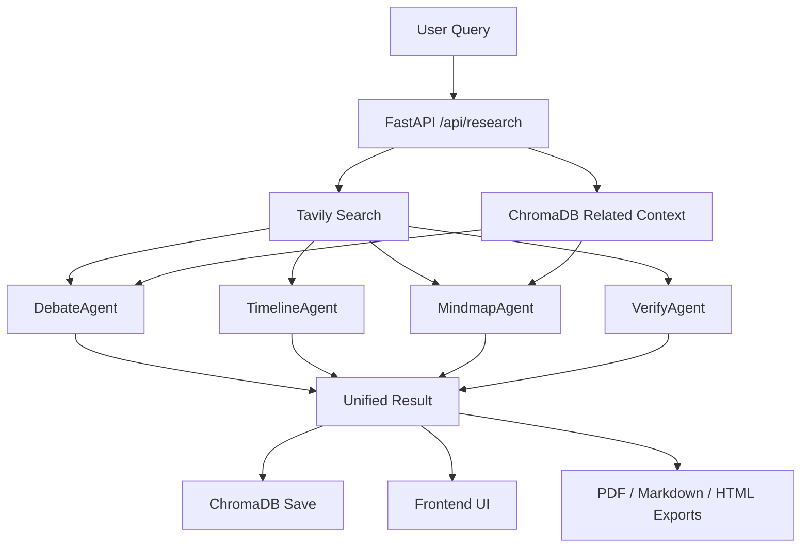
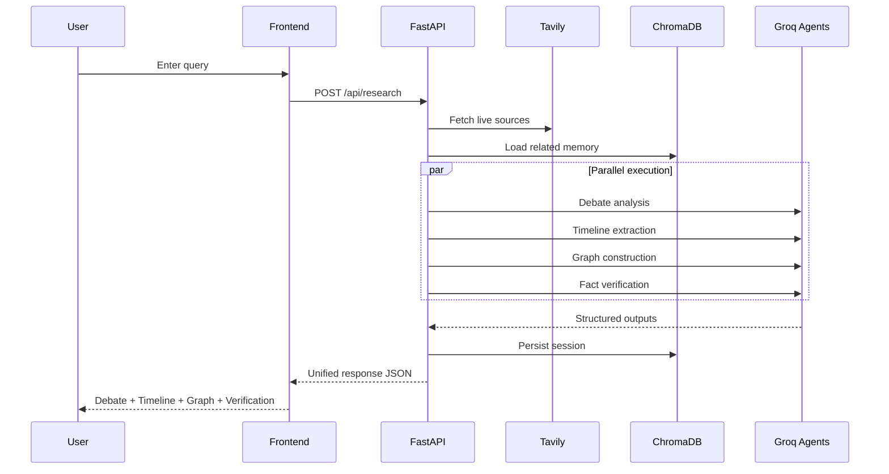

<div align="center">

# 🔬 Nexus Research

### _Your AI Research Companion That Thinks in Four Dimensions_

[](https://python.org)
[](https://fastapi.tiangolo.com/)
[](https://groq.com)
[](https://tavily.com)
[](https://trychroma.com)
[](https://docker.com)
[](LICENSE)

<br>

<p>
<strong>One query. Four AI agents. Real-time web search, debate analysis, historical timelines, knowledge graphs, and fact verification — all executed in parallel with live WebSocket streaming.</strong>
</p>

> _"Research the way a researcher actually thinks — not the way a chatbot answers."_

</div>


## 🚀 Overview

**Nexus Research** is a multi-agent AI research platform that analyzes any topic through four distinct analytical lenses simultaneously. Instead of a single LLM response, you get a comprehensive, multi-dimensional research report — complete with interactive visualizations, source-grounded facts, and exportable reports in PDF, Markdown, and HTML formats.

### What Makes It Different

| Traditional Research Tools | Nexus Research |
|:---|:---|
| Single LLM response | **4 parallel AI agents**, each with a distinct analytical lens |
| No source grounding | **Real-time Tavily web search** feeds every agent with live data |
| Stateless conversations | **ChromaDB vector memory** persists & semantically retrieves past sessions |
| Text-only output | **Interactive knowledge graph** (vis-network) + PDF / Markdown / HTML export |
| Sequential processing | **Async parallel execution** — all 4 agents run simultaneously via `asyncio.gather` |
| No progress feedback | **WebSocket streaming** — real-time stage updates as each agent completes |


## 🧠 The Four Research Dimensions

Every query is analyzed through **four specialized AI agents** running in parallel:

```
                         ┌──────────────────┐
                         │    USER QUERY    │
                         └────────┬─────────┘
                                  │
                     ┌────────────┴────────────┐
                     │   Tavily Web Search      │
                     │   5 results · basic/deep │
                     └────────────┬────────────┘
                                  │
              ┌───────────┬───────┴───────┬───────────┐
              ▼           ▼               ▼           ▼
        ┌──────────┐ ┌──────────┐ ┌────────────┐ ┌──────────┐
        │  DEBATE  │ │ TIMELINE │ │ KNOWLEDGE  │ │   FACT   │
        │  AGENT   │ │  AGENT   │ │   GRAPH    │ │ VERIFIER │
        └────┬─────┘ └────┬─────┘ └─────┬──────┘ └────┬─────┘
             │            │              │             │
             └────────────┴──────┬───────┴─────────────┘
                                 ▼
                    ┌────────────────────────┐
                    │   Unified JSON Report  │
                    │   ChromaDB · PDF Export │
                    └────────────────────────┘
```

| | Dimension | Agent | Output |
|:-:|:----------|:------|:-------|
| ⚖️ | **Debate Analysis** | `DebateAgent` | Mainstream view, devil's advocate contrarian view, synthesis & verdict |
| 📅 | **Historical Timeline** | `TimelineAgent` | 8–12 chronological events with type badges, era summary, future outlook |
| 🕸️ | **Knowledge Graph** | `MindmapAgent` | 10–14 typed nodes + 12–18 weighted edges → interactive vis-network map |
| ✅ | **Fact Verification** | `VerifyAgent` | Per-claim status (verified / disputed / misleading), confidence score, key uncertainties |

## 🔄 Research Flowchart



## 🧭 Search Lifecycle




## 🛠️ Tech Stack

| Layer | Technology | Purpose |
|:------|:-----------|:--------|
| **LLM** | Groq — LLaMA 3.3 70B Versatile | Ultra-fast inference powering all 4 research agents |
| **Search** | Tavily Search API | Real-time web retrieval with configurable depth (up to 5 results/query) |
| **Backend** | FastAPI + Uvicorn | Async REST API + WebSocket with parallel agent orchestration |
| **Memory** | ChromaDB (PersistentClient) | Local vector database for semantic search across past sessions |
| **Export** | ReportLab + Markdown + HTML | Multi-format downloadable research reports |
| **Frontend** | Vanilla HTML / CSS / JS | Zero-build SPA — particle background, glassmorphism UI, dark/light theme |
| **Visualization** | vis-network 9.1.9 | Interactive, physics-based knowledge graph rendering |
| **Deployment** | Docker + Docker Compose | One-command containerized deployment |


## 🏗️ Architecture

```
frontend/index.html             ← Particle BG · Glassmorphism · vis-network · Dark/Light Theme (zero build)
        │
        │  REST API + WebSocket (CORS enabled)
        ▼
backend/main.py                 ← FastAPI app · asyncio.gather · REST + WS endpoints · Rate Limiting · Logging
├── search.py                   ← Tavily web search (5 results max, client reuse)
├── memory.py                   ← ChromaDB PersistentClient (vector store)
├── pdf_export.py               ← ReportLab PDF generation
└── agents/
    ├── debate.py               ← Mainstream vs contrarian + synthesis
    ├── timeline.py             ← Chronological events + era summary
    ├── mindmap.py              ← Knowledge graph nodes / edges / types
    └── verify.py               ← Per-claim fact verification + trust score
```


## ⚡ Quick Start

### Option A: Local Setup

#### 1. Clone & Install

```bash
git clone https://github.com/Yashaswini-V21/Nexus-Research.git
cd Nexus-Research
py -m pip install -r requirements.txt
```

#### 2. Configure API Keys

Create a `.env` file in the project root:

```env
GROQ_API_KEY=gsk_your_groq_api_key_here
TAVILY_API_KEY=tvly-your_tavily_api_key_here
```

> **Free tiers available:** [Groq Console](https://console.groq.com) (free) · [Tavily Dashboard](https://app.tavily.com) (1,000 free searches/month)

#### 3. Start the Backend

```bash
py -m uvicorn backend.main:app --reload --host 0.0.0.0 --port 8000
```

#### 4. Open the Frontend

Open `frontend/index.html` directly in your browser — **no build step, no Node.js required.**

### Option B: Docker (One Command)

```bash
# Set your API keys in .env first, then:
docker compose up --build
```

- **API:** http://localhost:8000
- **Frontend:** http://localhost:3000

## 🖥️ Frontend Experience

- Landing page introduces the four-dimension research model
- Workspace separates output into debate, timeline, graph, and verification tabs
- Knowledge graph includes zoom, fit, fullscreen, screenshot, physics toggle, legend, and node detail panel
- Verification cards show confidence bars and uncertainty summaries
- Sources are clickable and reports can be exported as PDF, Markdown, and HTML
- Theme toggle persists with local storage


## 📡 API Reference

| Method | Endpoint | Description |
|:-------|:---------|:------------|
| `POST` | `/api/research` | Run full 4D research on a query (rate-limited) |
| `GET` | `/api/history` | List all past research sessions |
| `GET` | `/api/history/{id}` | Retrieve a specific session by ID |
| `DELETE` | `/api/history/{id}` | Delete a session from ChromaDB |
| `POST` | `/api/export/pdf/{id}` | Download a session as a formatted PDF |
| `GET` | `/api/export/markdown/{id}` | Download a session as Markdown |
| `GET` | `/api/export/html/{id}` | Download a session as styled HTML |
| `WS` | `/ws/research` | WebSocket — real-time streaming with stage updates |

<details>
<summary><strong>Example Request & Response</strong></summary>

**Request:**

```json
{
  "query": "Impact of AGI on the global economy",
  "depth": "deep"
}
```

**Response:**

```json
{
  "id": "uuid",
  "query": "...",
  "timestamp": "ISO 8601",
  "search_summary": [{ "title": "...", "url": "...", "content": "..." }],
  "debate": {
    "mainstream_view": {},
    "contrarian_view": {},
    "synthesis": "...",
    "verdict": "..."
  },
  "timeline": {
    "events": [],
    "era_summary": "...",
    "future_outlook": "..."
  },
  "mindmap": {
    "nodes": [],
    "edges": [],
    "central_insight": "..."
  },
  "verify": {
    "claims": [],
    "overall_confidence": 0.0,
    "key_uncertainties": []
  }
}
```

</details>


## 📁 Project Structure

```
Nexus-Research/
├── requirements.txt              # Python dependencies
├── README.md
├── Dockerfile                    # Container image for the API
├── docker-compose.yml            # One-command deployment (API + Nginx)
├── .dockerignore
├── .env                          # API keys (GROQ + TAVILY)
├── backend/
│   ├── main.py                   # FastAPI app — REST + WebSocket + rate limiting + logging
│   ├── search.py                 # Tavily search wrapper (client reuse)
│   ├── memory.py                 # ChromaDB vector memory
│   ├── pdf_export.py             # ReportLab PDF exporter
│   └── agents/
│       ├── __init__.py           # Clean agent imports
│       ├── debate.py             # DebateAgent (Groq)
│       ├── mindmap.py            # MindmapAgent (Groq)
│       ├── timeline.py           # TimelineAgent (Groq)
│       └── verify.py             # VerifyAgent (Groq)
├── frontend/
│   └── index.html                # Full SPA (dark/light theme, WebSocket, vis-network)
└── chroma_db/                    # Auto-created on first run
```


## 🎯 Design Philosophy

| Decision | Rationale |
|:---------|:----------|
| **Parallel agents** via `asyncio.gather` | 4x faster than sequential — all agents run simultaneously |
| **WebSocket streaming** | Real-time progress — users see each agent complete live |
| **Fault-tolerant agents** | Each agent wrapped in `_safe_run()` — one failure won't crash the whole report |
| **Rate limiting** | Per-IP throttle (configurable via `RATE_LIMIT_RPM` env var) protects the API |
| **Structured logging** | Python `logging` module across all files — production-ready observability |
| **ChromaDB for memory** | Semantic similarity search across past research; fully local, zero cloud dependency |
| **Zero-build frontend** | Single HTML file — no npm, no webpack, no React. Opens instantly in any browser |
| **Dark / Light theme** | Persistent theme toggle with `localStorage` — respects user preference |
| **Multi-format export** | PDF (styled), Markdown (portable), HTML (self-contained) — one click each |
| **Groq inference** | LLaMA 3.3 70B at 300+ tokens/sec — near-instant agent responses |
| **Docker Compose** | One-command deployment — API + Nginx frontend, persistent ChromaDB volume |


## 🗺️ Roadmap

- [x] WebSocket progress streaming
- [x] Docker Compose support
- [x] Dark/light theme toggle
- [x] Markdown and HTML export
- [x] Rate limiting and logging
- [x] Fault-tolerant per-agent execution
- [x] Graph controls and node inspection
- [ ] Multi-model comparison
- [ ] Shared collaborative sessions
- [ ] Scheduled recurring research
- [ ] Authentication and multi-user support


## 🤝 Contributing

Contributions, issues, and feature requests are welcome! Feel free to open an issue or submit a pull request.


<div align="center">

**Nexus Research** — Multi-agent AI research platform with async orchestration, real-time WebSocket streaming, vector memory, interactive visualization, and multi-format export.

📬 **Contact:** [yashasyashu0987@gmail.com](mailto:yashasyashu0987@gmail.com)

<sub>Built with Groq · Tavily · FastAPI · ChromaDB · vis-network · ReportLab · Docker</sub>

</div>

